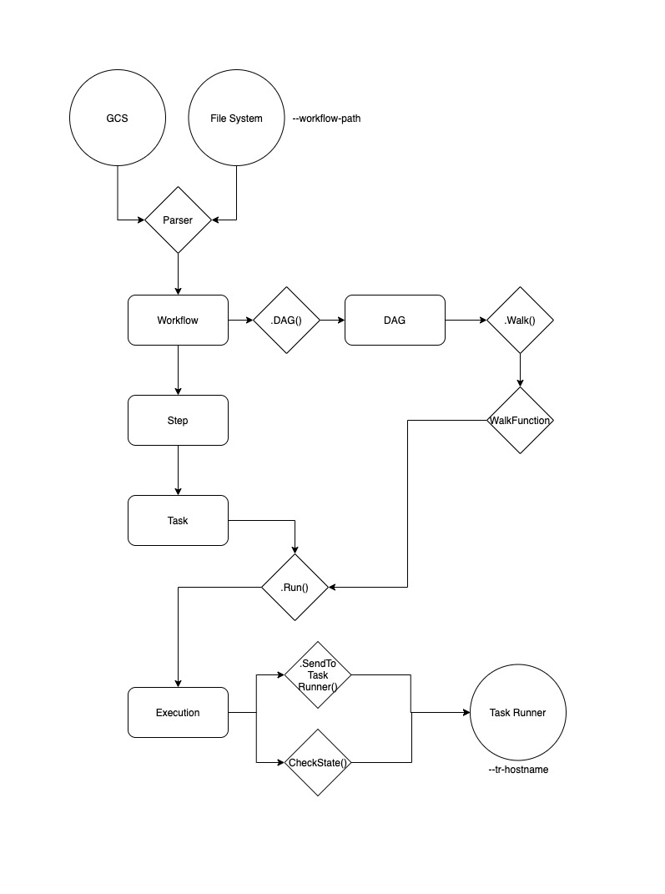

# Atom Workflows

## Task
### Description
Workflow task is taking as inputs a Worklow representation (DAG) and a Cloud Run
hostname (scheme + hotname) and will execute it.

### Parameters
| Parameter | Description | Default Value | Example | Optional |
| ------------- |-------------|-----|-----|:-----:|
| --dag-path | Path to the DAG you want to execute |  |gs://your-bucket/dags/your-dag.yaml | N |
| --tr-hostname | Hostname of the Task Runner |  |https://taskrunnermock-rps3r5yvgq-ew.a.run.app | N |
| --tr-auth-jwt | JWT to use to connect to the Task Runner |  |xxx.yyy.zzz | Y |

## Development environment
### How to use a local Mock for the Task Runner

#### Clone the repository
```
git clone https://github.com/lvmh-group/atom-container-kernel-task-runner.git
cd atom-container-kernel-task-runner
git checkout mock
```

#### Build the Docker image
```
docker build -t taskrunner:mock .
```

#### Run the sever
```
docker run \
    --rm -it \
    -e PORT=8080 \
    -v $HOME/.config:/root/.config \
    -p 8080:8080 \
    taskrunner:mock
```
`-v $HOME/.config:/root/.config` will let you share your own Gcloud authentification credentials.

#### Run your workflow task
```
go run main.go \
    --dag-path=./dags/fork_join_dag.yaml \
    --tr-hostname=http://localhost:8080 \
    --tr-auth-jwt=none
```

### How to use a Mock for the Task Runner on Cloud Run
#### Build and deploy your image
```
export PROJECT_ID=grp-sta-atom-prj-aelab
docker tag task_runner:mock eu.gcr.io/${PROJECT_ID}/run/task_runner:mock
docker push eu.gcr.io/${PROJECT_ID}/run/task_runner:mock
gcloud run deploy \
    --image eu.gcr.io/${PROJECT_ID}/run/task_runner:mock \
    --platform managed \
    --project=${PROJECT_ID}
# it will return your endpoint (i.e. https://taskrunnermock-rps3r5yvgq-ew.a.run.app)
```
#### Run your workflow task
```
go run main.go \
    --dag-path=./dags/fork_join_dag.yaml \
    --tr-hostname=https://taskrunnermock-rps3r5yvgq-ew.a.run.app \
    --tr-auth-jwt=$(gcloud auth print-identity-token)
```

## Internal documentation

### Data structure


### Limitations
#### Credentials
The Workflow task required a Service Account (and cannot use gcloud authentification). This limitation
comes from the `google.golang.org/api/idtoken` modules. You will get the following error message otherwise:
```
error message: idtoken: credential must be service_account, found "authorized_user".
```

## [DEV] Deployment
```
PROJECT_ID=grp-sta-atom-prj-aelab
docker build -t workflow .
docker tag workflow eu.gcr.io/$PROJECT_ID/images/workflow          
docker push eu.gcr.io/$PROJECT_ID/images/workflow
```
